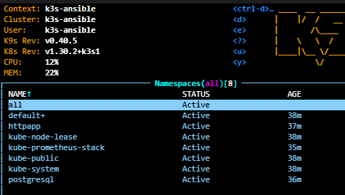

# TEST Kubernetes Cluster with Task and Ansible (using a easy bash start.sh script)

## Overview
This project provides an automated way to set up a **K3s Kubernetes cluster** using **Ansible** and **Taskfile**. It prepares a **controller machine** that runs Ansible and deploys a **K3s cluster** based on the configuration defined in the inventory file, this is totally based on this: **https://github.com/k3s-io/k3s-ansible**. After setting up the cluster, the system deploys several applications, including:

- **An HTTP  application** endhak/http-https-echo
- **PostgreSQL** Bitnami Helm Chart official postgres with two replicas.
- **Prometheus Stack** the widely used Promethus+Grafana+Alertmanager for obserbability

At the end of the process, **k9s** is opened on the controller machine to facilitate interaction with the cluster. **k9s** is extra-usefull for not be typing kubectl commands.

## Requirements
1. A controller machine (running Ubuntu) that will execute the script start.sh that will run the tasks in the Taskfile.
2. SSH connectivity with **PEM key authentication** between the controller machine and the target nodes. This user **NEEDS** root privilages.
3. The inventory in the route: **k3s-ansible/inventory.yml** file must be properly configured with the variables needed and the master/worker IPs.
4. At least two virtual machines (in this case **UBUNTU**) to create de Kubernetes Cluster and one machine in where Ansible and all automations will be run.

## Project Structure

```
README.md     # this what you are reading
Taskfile.yml  # where the automations happen
start.sh      # execution script
k3s-ansible/  # The role https://github.com/k3s-io/k3s-ansible but with some added on the playbooks/site.yml
installation_apps/  # contains Helm charts, playbooks, and variable files for application deployment
  ├── deploy_http.yaml  # tasks for installing mendhak/http-https-echo app
  ├── deploy_postgres.yaml  # task for install PostgreSQL
  ├── deploy_prometheus-stack.yaml  # tasks to install rometheus stack
  ├── kube-prometheus-stack/  # Helm chart for Prometheus
  ├── postgresql/  # Helm chart for PostgreSQL
  ├── httpapp/  # Helm chart for mendhak/http-https-echo app application
  ├── main.yaml  # Main Ansible playbook for application deployment that calls all the others.
  ├── vars.yaml  # Variable for applications
```

## Configuring the Inventory File
The `inventory.yml` file (located in `k3s-ansible/`) must be edited before running the setup. The structure should be:

```yaml
k3s_cluster:
  children:
    server:
      hosts:
        <master-node-ip-1>:
    agent:
      hosts:
        <worker-node-ip-1>:
  
  vars:
    ansible_user: "your_ssh_user"
    k3s_version: v1.30.2+k3s1
    token: "changeme!"
    # there more and more values check them in `/k3s-ansible/inventory.yml`
```


### Important Notes:
- **Ensure SSH connectivity** is established between the controller machine and the target nodes.
- The **user must have root privileges** to install K3s.
- If an **external IP** is used, the kubeconfig will be configured accordingly for remote access, this is done automatically with a task in the /k3s-ansible/playbooks/site.yml
- The cluster will be installed **without a LoadBalancer, Ingress Controller, or any special networking setup.** it is **COMPLETELY**  a K3S vanilla installation.

## Installation and Execution Steps

### 1️⃣ Clone this repo
```sh
git clone https://github.com/valkiriaaquatica/ansible_kubernetes.git
cd ansible_kubernetes
```

On the controller machine, execute the following commands:

### 2️⃣ Modify Inventory and Variables
Edit the inventory file to specify the IPs of your master and worker nodes in your virtual machines:
```sh
nano k3s-ansible/inventory.yml
```
Ensure that the `master` and `worker` node IPs are correctly set in the `inventory.yml` file.

### 3️⃣ Set Execution Permissions
Ensure that `start.sh` is executable:
```sh
chmod +x start.sh
```

### 4️⃣ Run the Setup Process
Execute the following command to start the **automated deployment**:
```sh
./start.sh
```
If all runs good, a k9s like this will be prompt:



## How the Taskfile Works
The `Taskfile.yml` automates multiple steps, making the setup seamless:

1. **Install Python, pip, and Task.**
2. **Create a Python virtual environment** and install Ansible dependencies.
3. **Install necessary Ansible collections**, including `kubernetes.core` and `k3s-ansible`.
4. **Install CLI tools** (kubectl, helm, and k9s) on the controller machine.
5. **Deploy the Kubernetes cluster** using the K3s role and **Fetch and configure the kubeconfig file** at
   ```sh
   {{ lookup('env','HOME') }}/.kube/k3s_config.yaml
   ```
6. **Deploy the required applications** in the cluster:
   - HTTP mendhak/http-https-echo  Application (own easy Helm chart). Can be accessed on the node IP on port 8080 ->  **http://node_external_ip:8080** or even better in the Ansible controller machine with: 
   ```sh
    kubectl port-forward svc/httpapp -n httpapp 8080:8080
   ```
   - PostgreSQL Bitnami Helm Chart with two replicas. It creates also pv, and servicemonitors.
   - Prometheus Stack for monitoring also be accessed in the same node as is NodePort or it it's needed and better for testing purpopses just forwarding: 
   ```sh
    kubectl port-forward svc/kube-prometheus-stack-grafana -n kube-prometheus-stack 8000:80
   ```
   #### Ansible, after installs one application it checks using the assert module if the application is well deployed.
8. **Open k9s** for real-time cluster interaction in the same terminal where the start.sh script was run.

### Important Files Used: 
The `installation_apps/main.yaml` playbook includes a playbook that calls tasks for installing applications and run some assert validations/tests.
```yaml
- name: Install apps and verify their installation
  hosts: localhost
  gather_facts: false
  environment:
    KUBECONFIG: "{{ lookup('env','HOME') }}/.kube/k3s_config.yaml"
  tasks:
    - name: Include global variables
      ansible.builtin.include_vars:
        file: ./vars.yaml

    - name: Deploy HTTP application
      ansible.builtin.include_tasks:
        file: ./deploy_http.yaml
      tags: http

    - name: Deploy PostgreSQL
      ansible.builtin.include_tasks:
        file: ./deploy_postgres.yaml
      tags: postgresql

    - name: Deploy Prometheus Stack
      ansible.builtin.include_tasks:
        file: ./deploy_prometheus-stack.yaml
      tags: prometheus
```

### Variables (`installation_apps/vars.yaml`)
This is the variables that the previous playbook pull. Here is defined variables to install the applications.
```yaml
app_http:
  name: "httpapp"
  chart_path: "httpapp"
  namespace: "httpapp"

app_postgresql:
  name: "postgresql"
  chart_ref: "oci://registry-1.docker.io/bitnamicharts/postgresql"
  namespace: "postgresql"
  values_file: "postgresql/values.yaml"

app_kube_prometheus:
  name: "kube-prometheus-stack"
  chart_ref: "prometheus-community/kube-prometheus-stack"
  namespace: "kube-prometheus-stack"
  values_file: "kube-prometheus-stack/values.yaml"
```


## Final Step: Accessing the Cluster
Once the setup is complete, **k9s** will launch automatically. You can also verify the cluster manually:
```sh
export KUBECONFIG=/home/$USER/.kube/k3s_config.yaml 
kubectl get nodes
```


## Improvements that can be done easily
- If it's on premise run a Mettallb+Ingress nginx for exposing the applications with LoadBalancer
- Use ansible-vault to encrypt sensitive values.
- Add TLS termination on ingresses with cert-manager.

